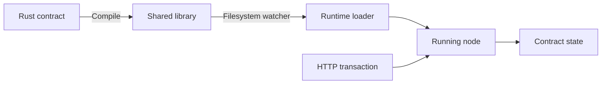

# Denali

**Native Rust contracts, loaded at runtime.**

Denali is a blockchain prototype built around an extensible contract runtime. Contracts compile into shared libraries that a running node can discover and execute, adding new behavior without recompiling or restarting the node.

The project brings together dynamic linking, procedural macros, async Rust, and QUIC networking in a transaction pipeline: submit a request, execute a contract, produce a block, and replicate it across nodes.

## Runtime Contracts

1. **Write a contract** implementing the shared [`Thing` trait](denali/src/types.rs), with a name, version, verification hook, and async execution method.
2. **Generate its entry point** with the [`#[generate_create_thing]` procedural macro](macros/src/lib.rs), which exports the constructor used by the loader.
3. **Compile it as a `cdylib`** and move the resulting `.so` into the watched `plugins/` directory.
4. **Execute it through HTTP.** The [loader](denali/src/plugins.rs) opens the library with `libloading`, reconstructs the contract interface, and registers it by name. Contracts can read and write shared state and return execution logs.



The [vote contract](example_contracts/vote/src/lib.rs) is the working example and starting point for new contracts. Build plugins with the same node sources, toolchain, and build profile. They execute trusted native code in-process; the interface uses unsafe trait-object reconstruction and does not provide a stable ABI or sandbox.

## Node Architecture

A **receiver** accepts HTTP transactions and forwards batches over QUIC to a **validator**, which executes contracts and returns new blocks. Optional **archivers** synchronize those blocks for chain queries.

- **Tokio:** Tasks, bounded channels, one-shot acknowledgments, and notifications coordinate the pipeline.
- **Quinn + rustls:** A custom request/notification protocol transports transactions and blocks over QUIC.
- **Axum, Borsh, and DashMap:** HTTP endpoints, binary serialization, and shared in-memory contract state.

## Synchronizing New Nodes

A new archiver can join an existing network, download its block history over QUIC, and begin serving chain queries. After the initial synchronization, it requests subsequent blocks from its current tip.

Development testing used [Goose](load-test/README.md) to generate large chains and repeatedly bring fresh nodes online, checking that their complete chain hashes matched an existing node. The [replication tests](denali/src/chain.rs) also compare height, tip, and the SHA-256 hash of the entire serialized block collection after transfer.

## Try It Locally

Use Linux and a current stable Rust toolchain. Run the following from the repository root, with an initially empty `plugins/` directory to demonstrate loading a contract into running nodes.

### 1. Build

On Debian or Ubuntu, install the native dependencies, then build the node and example contract:

```bash
sudo apt-get update
sudo apt-get install -y build-essential clang libclang-dev cmake pkg-config libssl-dev curl openssl
cargo build --locked -p denali -p vote
mkdir -p plugins
```

The first build also compiles RocksDB. The loader currently discovers Linux `.so` libraries.

<details>
<summary><strong>2. Prepare local TLS files (required once)</strong></summary>

Automatic certificate creation is unfinished. Generate the files below; each node command uses the same data directory under `target/`.

```bash
cert_dir="$PWD/target/denali-local/quinn-examples"
mkdir -p "$cert_dir"
chmod 700 "$cert_dir"
openssl req -x509 -newkey rsa:2048 -nodes \
  -keyout "$cert_dir/key.pem" -out "$cert_dir/cert.pem" \
  -days 365 -subj '/CN=localhost' \
  -addext 'subjectAltName=DNS:localhost' \
  -addext 'basicConstraints=critical,CA:FALSE' \
  -addext 'extendedKeyUsage=serverAuth'
openssl x509 -in "$cert_dir/cert.pem" \
  -outform DER -out "$cert_dir/cert.der"
openssl pkcs8 -topk8 -nocrypt -in "$cert_dir/key.pem" \
  -outform DER -out "$cert_dir/key.der"
chmod 600 "$cert_dir/key.pem" "$cert_dir/key.der"
```

</details>

### 3. Start the Nodes

Start the receiver in one terminal:

```bash
XDG_DATA_HOME="$PWD/target/denali-local" \
  ./target/debug/denali --role 0 --web-port-number 3000
```

Wait for `listening on 127.0.0.1:4433`, then start a validator in another terminal:

```bash
XDG_DATA_HOME="$PWD/target/denali-local" \
  ./target/debug/denali --role 1 --web-port-number 3007 --quic-port-number 4437
```

Before continuing, check that the receiver has the genesis block: this should return `1`.

```bash
curl -sS http://127.0.0.1:3000/chain-height
```

Clients connect to `localhost:4433`; `--quic-port-number` selects their local UDP port. Choose other HTTP ports if these are occupied and adjust the example URLs. All terminals must use the same repository directory.

### 4. Load a Contract Without Restarting

With both nodes running, stage the compiled vote contract and rename it into `plugins/`:

```bash
mkdir -p plugins/.staging
cp target/debug/libvote.so plugins/.staging/
mv plugins/.staging/libvote.so plugins/
```

The watcher handles files **renamed into the directory**; copying directly into it does not trigger runtime loading. Wait for `Created new vote` in both terminals. Existing `.so` files are also discovered at startup. Use this workflow for new contracts; replacing a loaded library is not a supported upgrade mechanism.

### 5. Execute It

Submit ten transactions to the receiver to trigger a batch:

```bash
for i in {1..10}; do
  curl -sS --max-time 10 http://127.0.0.1:3000/submit \
    -H 'Content-Type: application/json' \
    -d '{"program":"vote","payload":{"candidate":"0"}}'
done
```

Each response contains `tx_id:0x<hash>`. This acknowledges queuing; execution follows asynchronously. Batches contain **10 transactions**, with no timeout to flush a partial batch.

After processing, the height should be `2`. Inspect the block's transactions:

```bash
curl -sS http://127.0.0.1:3000/chain-height
tip=$(curl -fsS http://127.0.0.1:3000/tip)
curl -sS -G http://127.0.0.1:3000/get-block-transactions \
  --data-urlencode "block_hash=${tip#0x}"
```

### 6. Bring a New Node Online

Start an archiver after producing blocks. It will synchronize the existing history:

```bash
XDG_DATA_HOME="$PWD/target/denali-local" \
  ./target/debug/denali --role 2 --web-port-number 3001 --quic-port-number 4431
```

With submissions paused, wait for both nodes' `/chain-height` values to match, then compare their full-chain hashes:

```bash
curl -fsS -w '\n' http://127.0.0.1:3000/get/chain-hash
curl -fsS -w '\n' http://127.0.0.1:3001/get/chain-hash
```

Both hashes should agree. Submit another batch to check that the archiver continues following the chain, or restart the archiver to repeat synchronization from an empty in-memory chain.

Stop nodes with `Ctrl+C`. State and chain history currently live in memory.

## Explore the Code

| Component | Source |
| --- | --- |
| Contract interface, loader, and filesystem watcher | [types.rs](denali/src/types.rs), [plugins.rs](denali/src/plugins.rs), [plugin tasks](denali/src/plugins/plugin_task.rs) |
| Generated contract constructor | [macros](macros/src/lib.rs) |
| Transaction batching and block production | [messaging.rs](denali/src/messaging.rs), [processor](denali/src/processor.rs) |
| QUIC synchronization and HTTP endpoints | [networking](denali/src/quinn/), [HTTP handlers](denali/src/web/endpoints.rs) |

Run tests with `cargo test --locked --workspace`. The suite covers chain operations, replication, hash conversions, and contract execution; [GitHub Actions](.github/workflows/rust.yml) runs builds and tests. Goose reports HTTP submission performance; chain synchronization and hash agreement are checked separately.

## Status

This is an experimental local network with a single validator. Consensus, complete block integrity checks, durable storage, reliable batch delivery, recovery, and plugin lifecycle management remain unfinished. Some error paths still panic. The existing Docker image also needs a toolchain update and certificate provisioning; use the local setup above.
